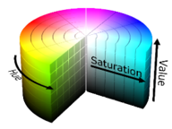
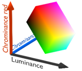
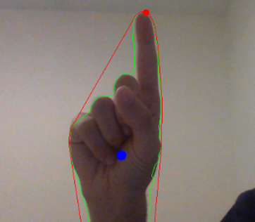
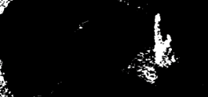
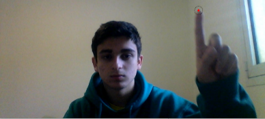

# Alpha Research Project
Alpha Research Project: Hand Detection and Tracking, using an RGB camera, for Basic Human Computer Interface

עבודת חקר בתוכנית "אלפא": זיהוי ומעקב היד ותנועתה, באמצעות מצלמצת RGB, למטרת שליטה במחשב

<a href="https://drive.google.com/file/d/1ibmjMPVQLqvh7tMHUxT2VuWyf30ugcjh/view?usp=sharing"> Project Booklet (with full results and details)</a>

## Introduction

מטרת המחקר היא לבנות תוכנה, המאפשרת שליטה ותזוזה של הסמן (cursor) על ידי האצבע, באמצעות שימוש במצלמה. על התוכנה להפריד את שטח היד, מצילום בזמן אמת, ולאתר נקודת סימון המייצגת את מיקום הסמן. בעבודה זו, נחקרו לעומק ונערכנו ניסיונות על כמה שיטות להפרדת היד על מנת להגיע לשיטה יחידה שתוכל לעבוד במקרים רבים.

## Hand Seperation

 
  ראשית, על התוכנה להפריד את שטח היד משאר התמונה. רוב שיטות ההפרדה שנבדקו הן ווריאציות של הפרדה לפי מרחבי צבע (Color Spaces). בגישה זו, נעשת המרה של כל פריים מהצילום למרחב צבע מסוים (תמונה 1), ונקבע תחום הפרדה שאמור לבסוף להסיר את כל הרקע מהתמונה, ולהשאיר רק את שטח היד.
 

בנוסף, נבנתה מערכת להגדרת תחום הפרדה המותאם למשתמש. בהפעלה הראשונית של התוכנה, נלקחת "דגימה" של פיקסלים צבע עור, וכל מה שאינו תואם לדגימה הזו, ונמצא בתחום שנוצר, מוסר מהתמונה.

</img>
</img>

תמונה 1 - תיאורים ויזואלים של מרחב צבע HSV (ימין), ו- YCbCr (שמאל) שנעשה בהם שימוש בעבודה

## Landmark Finder

על מנת שהמשתמש יוכל להפעיל את הסמן, התוכנה צריכה לאתר נקודת סימון שתייצג את מיקום האצבע המורה. ראשית, התוכנה מחשבת את מיקום נקודת האמצע של שטח היד. לאחר מכן, התוכנה יוצרת שני סוגי מסגרות סביב היד (convex hull ו- contour line) ובעזרתם מאתרת את ה"בליטה" הכי משמעותית ביד, שהיא תהיה שווה לנקודת הסימון (תמונה 2).
  

</img>

תמונה 2 – תיאור של תהליך מציאת נקודת הסימון. ניתן לראות את ה-contour  המתאר את שטח היד (קו ירוק), נקודת האמצע (נקודה כחולה), ה- convex hull (קו אדום), ונקודת הסימון הסופית (נקודה אדומה)

## Testing System

בעבודה זו, נבחנו שיטות הפרדה בכמה מאגרים שונים על מנת לבחון את היתרונות והחסרונות של כל שיטה בתנאי תאורה ורקע שונים.
על מנת לכמת את יכולת טכניקות ההפרדה, חושב מדד המציין את אחוז התמונות בכל מאגר, שבהן נקודת הסימון שנמצאה על ידי התוכנה, תואמת למיקום האמיתי של נקודת הסימון (סומנו על כל המאגרים באופן ידני) בטווח של עשרים פיקסלים.

## Results

  לפי התוצאות הכמותיות והאיכותיות, לא נראה שנמצא טווח "אידיאלי" להפרדת היד והסרת הרקע, שעובד בכל המקרים באופן מלא. עם זאת, כן נראה שאפשר להעזר בפעולה המשלבת הפרדה במרחב הצבע YCbCr ו-  Otsu’s Binarization(תמונה 3), כדי להשתמש במערכת הזזת הסמן, אך רק עם רקע לבן ותאורה יציבה (אחוז הצלחה של 72.67). 
אחוזי ההצלחה של אלגוריתמים המבוססים על הגדרת תחום הפרדה המותאם למשתמש, היו יותר נמוכים משיטות ההפרדה האחרות.

</img>
</img>

תמונה 3 – דוגמה לתוצאת ההפרדה (למעלה) והסימון (למטה), של אחת הפעולות המבוססות על מרחב הצבע YCbCr

## Conclusions

ניתן להמשיך ולשפר בדרכים שונות את היכולת של המערכת להפריד את היד, למצוא נקודות סימון, ולשלב הפעלה של פעולות מחשב יותר מורכבות.

במסגרת עבודה זו, אמנם לא נעשו ניסויים המבוססים על למידת מחשב, אך נעשתה סקירת ספרות מעמיקה בנושא. עם שיפורים ביכולת הפרדת היד, מערכות המבוססות על למידת מחשב יוכלו לייעל את תהליך מציאת נקודת הסימון, וזיהוי תנוחות ותנועות שלהם, ואכן נראה שעם מחקר נוסף, תוכל להיבנות מערכת HCI מלאה.

